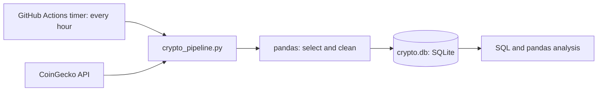

# Crypto Price Tracker

An automated pipeline that records the prices of the **top 20 cryptocurrencies every hour** and keeps the full history in a database. It runs in the cloud on a schedule, so it keeps collecting data even when my own computer is switched off.

> **Not financial advice.** This project only *observes and stores* prices. It does not buy, sell, or predict anything.

---

## In plain words

- A **cryptocurrency** is digital money that exists only on computers, with no bank or government issuing it (Bitcoin is the best-known one). Its price changes all day and night.
- Every hour, a small Python program asks a public data service (**CoinGecko**) "what are the top 20 coins and their prices right now?", tidies up the answer, and adds it to a database.
- A free cloud service (**GitHub Actions**) runs that program automatically, so nobody has to press a button.
- After a few days, the database holds a **price history** that can be charted and analysed.

## Quick facts

| | |
|---|---|
| **Goal** | Track the top 20 coins by market cap and keep hourly price history |
| **Data source** | [CoinGecko API](https://docs.coingecko.com) (free Demo / keyless plan) |
| **Language and tools** | Python, `requests`, `pandas`, SQLite |
| **Automation** | GitHub Actions, scheduled every hour (UTC) |
| **Storage** | `crypto.db` (SQLite), saved back into this repository after each run |

## How it works



1. **Timer:** GitHub Actions starts the job every hour.
2. **Fetch:** the script calls the CoinGecko API and receives the top 20 coins as JSON.
3. **Clean:** it keeps the columns needed, gives them short names, and stamps each row with the time it was fetched.
4. **Store:** it *adds* the rows to the `prices` table (it never overwrites old rows).
5. **Save:** the updated `crypto.db` is committed back to this repo, so the history is kept.

## The data

One row = one coin at one moment.

| Column | Meaning |
|---|---|
| `id` | CoinGecko's unique name for the coin, e.g. `bitcoin` |
| `symbol`, `name` | Short code and full name, e.g. `btc`, Bitcoin |
| `market_cap_rank` | Position in the ranking (1 = biggest) |
| `current_price` | Price of one coin in US dollars |
| `market_cap` | Total value of all coins in circulation (price x coins in circulation) |
| `total_volume` | Money traded in the last 24 hours |
| `change_1h`, `change_24h`, `change_7d` | Price change over the last hour, day and week, in percent |
| `last_updated` | When CoinGecko last updated this coin (UTC) |
| `scraped_at` | When *my program* fetched it (UTC) |

The table's key is `(id, scraped_at)`, so the database refuses to store the same coin at the same moment twice.

**Why market cap and not just price?** A $1 coin with 100 billion coins in circulation is bigger than a $50,000 coin with 1 million coins. Price alone can't rank coins, so "top 20" uses market cap.

---

## How I built it, step by step

### Step 1: Decide what to track
Before writing any code, I wrote the requirement in one line:
*"Every hour, fetch the top 20 coins by market cap (name, symbol, price, market cap, 24h volume, price changes, rank) and append them, with a timestamp, to a SQL table."*
Deciding *what data* I need first told me what to look for next.

### Step 2: Find out how the website delivers that data
I asked three questions, in order, using the browser's developer tools (press **F12**):

1. **Is the value in the page source?** (Ctrl+U, then search for a visible value.) If yes, the data is inside the HTML.
2. **If not, does a data request carry it?** (F12, Network tab, Fetch/XHR filter, then search for the value.) If yes, I can call that request directly and read JSON.
3. **If neither, the page needs a real browser.** That is when a tool like Selenium is used.

| What I found | Tool |
|---|---|
| Data in the HTML | `requests` + BeautifulSoup |
| Data as JSON inside a `<script>` tag | BeautifulSoup + `json.loads` |
| A JSON request or API that holds the data | `requests` + `.json()` |
| Nothing usable, page built by JavaScript | Selenium |

I practised these on scraping-friendly practice sites (books.toscrape.com, quotes.toscrape.com) and on real pages such as Wikipedia and Hacker News.

### Step 3: Prefer an official API over scraping the website
CoinGecko's own website is protected against bots and full of ads, and its terms don't invite automated scraping. But CoinGecko also sells and documents a **developer API** that returns the same data cleanly. I read its documentation and chose the endpoint `/coins/markets`, which returns coins with price, market cap, volume and rank. The docs also said the free plan refreshes about every 60 seconds, which is why hourly collection is more than enough.

### Step 4: Prototype in Google Colab
I built the pipeline in small notebook cells so I could see each result:
1. **Fetch:** call the API and check the response code is 200 and the result is a list of 20 items.
2. **Select:** keep 11 useful columns out of 30+.
3. **Clean:** rename the long percent-change columns, format times, and add `scraped_at`.
4. **Check:** look for missing values and wrong data types.

### Step 5: Save to a database
I stored the rows in SQLite with `if_exists="append"` (adds rows, keeps old ones). Running the save cell twice with the same data caused an `IntegrityError: UNIQUE constraint failed`. That was the primary key protecting the data: the same coin at the same time can't be stored twice.

### Step 6: Make it impossible to run in the wrong order
Cells run out of order caused that error. So I put fetch, clean and save into one function, `run_once()`, which always does the steps in the right order. This function became the heart of the script.

### Step 7: Turn the notebook into a script
`crypto_pipeline.py` does the same job, plus:
- **Retries:** if the API fails, it waits and tries again (up to 3 times).
- **Checks:** it refuses an empty or unexpected response.
- **Logging:** it prints what happened, so runs can be checked later.
- **Clear failure:** on an error it exits with a failure code, so the run shows up red.
- **Optional API key:** used only if a secret named `COINGECKO_API_KEY` exists.

### Step 8: Put it on GitHub
I created a public repository and added `crypto_pipeline.py`, `requirements.txt`, and the database from my Colab tests (so early history was kept).

### Step 9: Automate with GitHub Actions
I added `.github/workflows/collect.yml`. It:
1. Runs on a timer (`cron: "0 * * * *"`, every hour, UTC) and can also be started by hand.
2. Sets up Python and installs the libraries.
3. Runs the script.
4. Commits the updated `crypto.db` back to the repo.

Files must be in exactly the `.github/workflows/` folder, or GitHub ignores the workflow.

### Step 10: Test and verify
1. I started the workflow by hand (**Actions**, then **Run workflow**).
2. The run finished green. In the log, the script printed `Saved 20 rows to crypto.db`.
3. I downloaded the database from the repo into Colab and counted the rows and snapshots, to prove the data really was saved.

### Step 11: Sanity-check the data
- **Stablecoins** (Tether, USDC, USDS) came out least volatile, as expected for coins designed to stay near $1.
- **One coin (`figure-heloc`) never changed price** in any snapshot. Checking its rows showed the API really did report the same value each time, so it is a genuine quirk, not a bug.
- **XRP looked "calm" on my first volatility measure** even though its price fell about 2.6% in 90 minutes. The measure (spread of changes) hid a steady one-way move. I now also look at the total range and the average size of changes.

---

## Repository layout

```
crypto-price-tracker/
├── crypto_pipeline.py            # fetch, clean, save
├── requirements.txt              # requests, pandas
├── crypto.db                     # the growing price history (SQLite)
├── README.md                     # this file
└── .github/workflows/collect.yml # the hourly schedule
```

## Run it yourself

```bash
git clone https://github.com/Kamalieshrie/crypto-price-tracker.git
cd crypto-price-tracker
pip install -r requirements.txt
python crypto_pipeline.py
```

To run your own hourly copy, **fork** the repo and enable **Actions** in your fork. Add an API key as a repository secret named `COINGECKO_API_KEY` only if the API asks for one.

## Look at the data

```python
import sqlite3, pandas as pd
conn = sqlite3.connect("crypto.db")

# Latest snapshot, ranked
pd.read_sql("""
SELECT market_cap_rank, name, current_price, change_24h
FROM prices
WHERE scraped_at = (SELECT MAX(scraped_at) FROM prices)
ORDER BY market_cap_rank
""", conn)

# How far each coin has moved between its lowest and highest recorded price
pd.read_sql("""
SELECT id,
       ROUND((MAX(current_price) - MIN(current_price)) * 100.0 / MIN(current_price), 3) AS range_pct
FROM prices GROUP BY id ORDER BY range_pct DESC
""", conn)
```

<!-- Add a chart here once there is a day or more of data, for example: -->
<!--  -->

## Design decisions (and why)

| Decision | Reason |
|---|---|
| Official API, not HTML scraping | Allowed, stable, and returns clean numbers |
| Append-only table | Overwriting would erase the history, which is the whole point |
| Two timestamps | `last_updated` is when the source changed; `scraped_at` is when I fetched |
| Key on `(id, scraped_at)` | Prevents duplicate rows if a run repeats |
| Store times in UTC | One clear standard; convert to local time when displaying |
| Retries and logging | Real APIs fail sometimes, and unattended runs need a record |
| Cloud scheduler, not my laptop | It must work while my computer is off |

## Limitations

- **Hourly resolution.** It cannot show minute-by-minute movement.
- **The source updates about once a minute**, so values can be up to a minute old.
- **GitHub schedules can run late** (sometimes by several minutes) or be skipped during busy periods. GitHub can also pause scheduled workflows in a repo with no activity for a long time.
- **The database grows** and every version is kept in Git history. For a long-running version, a hosted database would be better.
- **The top 20 changes over time.** A coin can enter or leave the ranking, so some coins have gaps in their history. `market_cap_rank` is stored for that reason.
- **Some assets barely move** (stablecoins, some tokenised assets), which affects volatility comparisons.
- **Small early samples.** Statistics from the first few hours mean little; they need days of data.

## Ideas for next steps

- Charts of price over time and a volatility ranking on a day or more of data
- An alert (email or Telegram) when a coin moves more than a chosen percentage
- Move storage to a hosted database (for example a free PostgreSQL service)
- A small dashboard (for example Streamlit)
- Ask the API for more decimal places (`precision=full`) for low-priced coins

## Glossary

| Term | Meaning |
|---|---|
| **API** | A way for programs to ask a service for data; the service answers in a fixed format |
| **Endpoint** | One specific address on an API, such as `/coins/markets` |
| **JSON** | A text format for structured data (lists and labelled values) |
| **pandas / DataFrame** | A Python library and its table-like object for cleaning and analysing data |
| **SQLite** | A database stored in a single file |
| **Primary key** | The column(s) that identify a row uniquely; duplicates are rejected |
| **Append** | Add new rows without removing old ones |
| **UTC** | The world time standard (India Standard Time is UTC + 5:30) |
| **Cron** | A schedule notation; `0 * * * *` means "at minute 0 of every hour" |
| **GitHub Actions** | GitHub's free automation service that can run a script on a schedule |
| **Market cap** | Price of one coin multiplied by the number of coins in circulation |

## Credits

Price data from [CoinGecko](https://www.coingecko.com). Please follow CoinGecko's API terms, including any attribution the plan requires.
